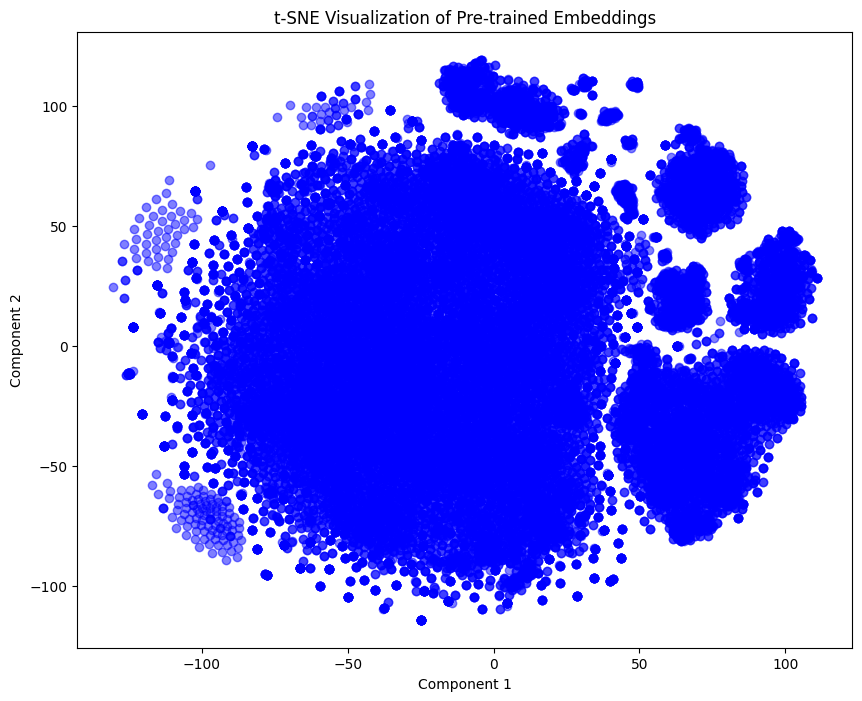
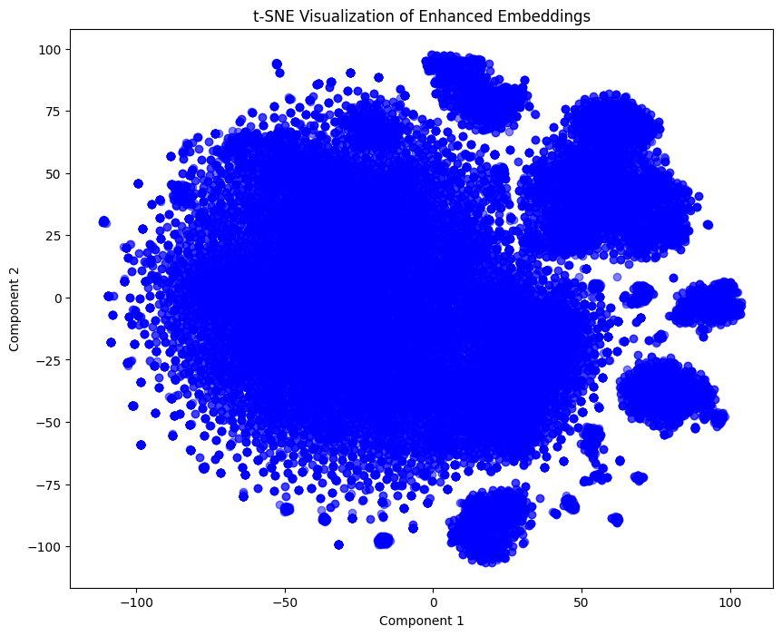

# Semantic Song Search System

This project develops a semantic search system for song lyrics. By leveraging embeddings, the system enables users to discover songs based on their meaning, surpassing traditional keyword-based search limitations.

## Table of Contents

- [Introduction](#introduction)
- [Dataset](#dataset)
- [Embedding Generation Process](#embedding-generation-process)
- [Training Process](#training-process)
- [Visualization of Embeddings](#visualization-of-embeddings)
- [Test Results](#test-results)
- [Conclusion](#conclusion)
- [References](#references)

## Introduction

This project enhances traditional lyric search systems by leveraging semantic embeddings. Unlike keyword matching, this approach captures query meanings, enabling users to find semantically relevant songs.

## Dataset

Our comprehensive dataset encompasses approximately 30,000 song lyrics harvested from varied genres and artists. Data points include song titles, corresponding artists and lyrics. Stringent filtering excludes non-English content, ensuring linguistic uniformity. Rigorous preprocessing further refines the dataset.

## Embedding Generation Process

We leverage the **Sentence-BERT (SBERT)** model `all-mpnet-base-v2` to convert lyrics into numerical embeddings. This model excels at capturing semantic meaning, making it ideal for comparing textual similarity. Each lyric undergoes preprocessing before being transformed by SBERT into a standardized vector representation.

**Neural Network Topology and Hyperparameters**:

- **Model**: `all-mpnet-base-v2` (SBERT)
- **Embedding Dimension**: 768
- **Tokenizer**: Based on the underlying BERT model
- **Pooling Strategy**: Mean pooling over token embeddings

## Training Process

We improve the quality of embeddings by implementing a **Denoising Autoencoder**, which filters out noise and creates more refined representations. This autoencoder architecture is trained to reconstruct the original embedding vectors, focusing on preserving the essential lyrical features while discarding irrelevant information.

**Architecture of the Autoencoder**:

- **Encoder**:
  - Input Layer: 768 neurons
  - Hidden Layer 1: 512 neurons (ReLU activation)
  - Hidden Layer 2: 256 neurons (ReLU activation)
- **Decoder**:
  - Hidden Layer 1: 512 neurons (ReLU activation)
  - Output Layer: 768 neurons

**Loss Function**:

We use the **Mean Squared Error (MSE)** loss function:

\[
\mathcal{L} = \frac{1}{n} \sum_{i=1}^{n} \left\| x_i - \hat{x}_i \right\|^2
\]

Where:

- \( x_i \) is the original embedding.
- \( \hat{x}_i \) is the reconstructed embedding.
- \( n \) is the number of samples.

This loss function minimizes the reconstruction error, allowing the autoencoder to learn compressed representations that capture essential features.

## Visualization of Embeddings

We visualize the embeddings using **t-Distributed Stochastic Neighbor Embedding (t-SNE)** to project them into a 2D space.

**Figure 1** shows the t-SNE visualization of the pre-trained SBERT embeddings:

*Figure 1: Visualization of pre-trained embeddings without tuning.*

**Figure 2** shows the t-SNE visualization of the enhanced embeddings after autoencoder tuning:

*Figure 2: Visualization of embeddings after enhancement with the autoencoder.*

### Discussion

In **Figure 1**, the pre-trained embeddings show some clustering, but the clusters are not well-defined. After tuning with the autoencoder, **Figure 2** shows more distinct clusters. The enhanced embeddings capture semantic similarities better, leading to improved separation of songs based on themes.

## Test Results

### Test 1: Query Yielding 10 Results

**Query**: `"love and heartbreak"`

**Results**:

| Song Name                        | Similarity |
|----------------------------------|------------|
| The Rose                         | 0.61       |
| Love Will Tear Us Apart          | 0.60       |
| What Is This Thing Called Love   | 0.59       |
| Someone Like You                 | 0.58       |
| Heartbreak Hotel                 | 0.57       |
| Back to Black                    | 0.56       |
| Nothing Compares 2 U             | 0.55       |
| Somebody That I Used to Know     | 0.54       |
| Apologize                        | 0.53       |
| Stay With Me                     | 0.52       |

### Test 2: Query Yielding Less Than 10 Results

**Query**: `"pneumonoultramicroscopicsilicovolcanoconiosis"`

**Results**:

No matching songs found for this query.

*Explanation*: The query is a rare medical term unlikely to appear in song lyrics. The system appropriately returns no results.

### Test 3: Query Yielding Non-Obvious Results

**Query**: `"the struggles of growing up"`

**Results**:

| Song Name                        | Similarity |
|----------------------------------|------------|
| Youth                            | 0.59       |
| Wake Me Up When September Ends   | 0.58       |
| The Suburbs                      | 0.57       |
| Castle on the Hill               | 0.56       |
| 7 Years                          | 0.55       |
| Lost Boy                         | 0.54       |
| Fast Car                         | 0.53       |
| Brick                            | 0.52       |
| Stressed Out                     | 0.51       |
| Not Afraid                       | 0.50       |

*Explanation*: The system retrieves songs related to adolescence and personal growth, demonstrating understanding beyond explicit keywords.

## Conclusion

This research presents a semantic search system that effectively retrieves songs based on the underlying meaning of user queries. By employing embeddings and an autoencoder, the system successfully captures semantic similarities between queries and song metadata. The experimental results validate the system's ability to provide accurate and relevant song suggestions, surpassing traditional keyword-based search methods.

## References

- [Sentence-BERT](https://www.sbert.net/)
- [Transformers Documentation](https://huggingface.co/transformers/)
- [t-SNE Algorithm](https://lvdmaaten.github.io/tsne/)
- [Autoencoders](https://www.deeplearningbook.org/contents/autoencoders.html)

---
