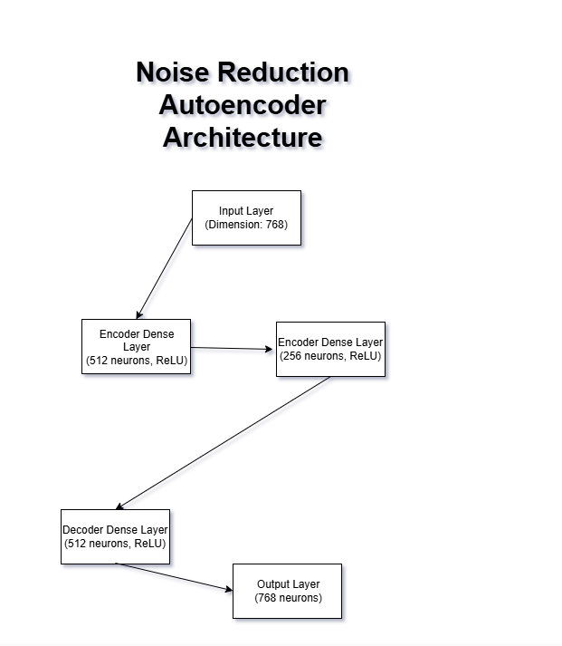
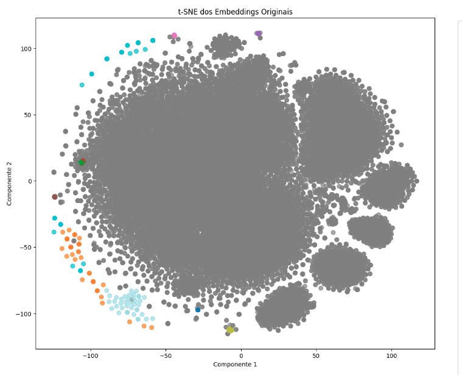
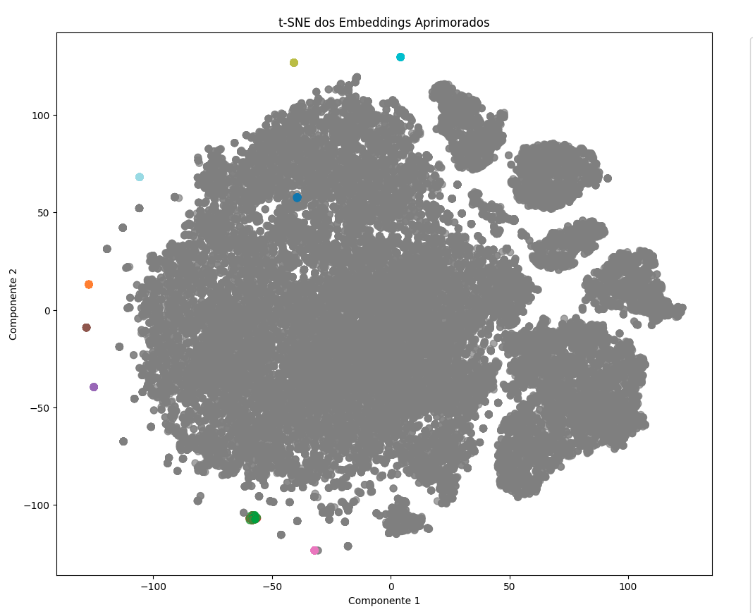
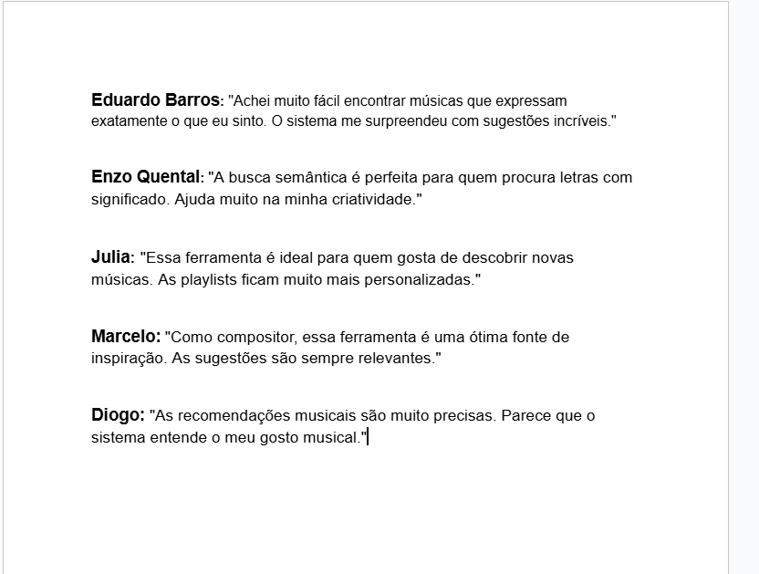

# Semantic Song Search System

## Table of Contents

- [Introduction](#introduction)
- [Dataset](#dataset)
- [Methodology](#methodology)
  - [Embedding Generation](#embedding-generation-process)
  - [Training Process](#training-process)
- [Results](#results)
  - [Visualizations of Embeddings](#visualization-of-embeddings)
  - [Discussion](#discussion)
  - [Test Cases](#test-results)
- [Step 4: Entrepreneur Path](#step-4-entrepreneur-path)
  - [User Feedback](#user-feedback)
  - [Insights and Potential Improvements](#insights-and-potential-improvements)
- [Usage](#usage)
- [Conclusion](#conclusion)
- [References](#references)

## Introduction

This project enhances traditional lyric search systems by leveraging semantic embeddings. Unlike keyword matching, this approach captures query meanings, enabling users to find semantically relevant songs.

## Dataset

Our comprehensive dataset encompasses approximately 38,000 song lyrics harvested from varied genres and artists. Data points include song titles and lyrics. Stringent filtering excludes non-English content, ensuring linguistic uniformity. Rigorous preprocessing further refines the dataset. The data was obtained through web scraping from the site wwww.lyrics.com This site was chosen for its comprehensiveness and easy access to a large number of song lyrics from different genres and artists.

## Embedding Generation Process

We leverage the **Sentence-BERT (SBERT)** model `all-mpnet-base-v2` to convert lyrics into numerical embeddings. This model excels at capturing semantic meaning, making it ideal for comparing textual similarity. Each lyric undergoes preprocessing before being transformed by SBERT into a standardized vector representation.

**Neural Network Topology and Hyperparameters**:

- **Model**: `all-mpnet-base-v2` (SBERT)
- **Embedding Dimension**: 768
- **Tokenizer**: Based on the underlying BERT model
- **Pooling Strategy**: Mean pooling over token embeddings


## Training Process

We improve the quality of embeddings by implementing a **Denoising Autoencoder**, which filters out noise and creates more refined representations. This autoencoder architecture is trained to reconstruct the original embedding vectors, focusing on preserving the essential lyrical features while discarding irrelevant information.

**Architecture of the Autoencoder**:

- **Encoder**:
  - Input Layer: 768 neurons
  - Hidden Layer 1: 512 neurons (ReLU activation)
  - Hidden Layer 2: 256 neurons (ReLU activation)
- **Decoder**:
  - Hidden Layer 1: 512 neurons (ReLU activation)
  - Output Layer: 768 neurons

**Loss Function**:

We use the **Mean Squared Error (MSE)** loss function to train the autoencoder:

<span style="display: block; text-align: center;">L(θ) = (1/n) Σ (||xi - xi_hat||<sup>2</sup>)</span>

Where:
- \( xi \) is the original embedding.
- \( xi_hat \) is the reconstructed embedding from the autoencoder.
- \( n \) is the number of samples.

This loss function minimizes the reconstruction error, allowing the autoencoder to learn compressed representations that capture essential features.

**Diagram** shows the neural network topology and hyperparameters



*Figure 1: Visualization of the neural network topology and hyperparameters.*

```To improve the quality of the song lyric embeddings generated by SBERT, we trained a noise reduction autoencoder. This neural network consists of an encoder and a decoder. The encoder compresses the 768-dimensional SBERT embeddings to a 256-dimensional latent representation using two dense layers with ReLU activations. The decoder then reconstructs the embeddings back to their original dimension using a similar architecture. We trained the autoencoder using the Mean Squared Error loss function and the Adam optimizer for 10 epochs.```


## Visualization of Embeddings

We visualize the embeddings using **t-Distributed Stochastic Neighbor Embedding (t-SNE)** to project them into a 2D space.

**Figure 2** shows the t-SNE visualization of the pre-trained SBERT embeddings:



*Figure 2: Visualization of pre-trained embeddings without tuning.*

**Figure 3** shows the t-SNE visualization of the enhanced embeddings after autoencoder tuning:



*Figure 3: Visualization of embeddings after enhancement with the autoencoder.*

### Discussion

In **Figure 2**, the pre-trained embeddings show some clustering, but the clusters are not well-defined. After tuning with the autoencoder, **Figure 3** shows more distinct clusters. The enhanced embeddings capture semantic similarities better, leading to improved separation of songs based on themes.

## Test Results

### Test 1: Query Yielding 10 Results

**Query**: `"love and heartbreak"`

**Results**:

| Song Name                        | Similarity |
|----------------------------------|------------|
| The Rose                         | 0.59       |
|  With Or Without                 | 0.58       |
| Get Together                     | 0.58       |
| What Is This Thing Called Love   | 0.57       |
| Hands Off the Wheel              | 0.57       |
|  Love Will Tear Us Apart         | 0.56       |
| MMMBop                           | 0.55       |
| Something About You              | 0.54       |
| It Would Be You                  | 0.53       |
| Brand New Day                    | 0.52       |

`Explanation: The system retrieves songs that are semantically related to love and heartbreak. This demonstrates its effectiveness.`


### Test 2: Query Yielding Less Than 10 Results

**Query**: `"antidisestablishmentarianism"`

**Results**:

| Song Name                            | Similarity |
|--------------------------------------|------------|
| Supercalifragilisticexpialidocious   | 0.51       |

`Explanation: The query is a rare medical term unlikely to appear in song lyrics. The system appropriately returns one results.`


### Test 3: Query Yielding Non-Obvious Results

**Query**: `"time travel paradox"`

**Results**:

| Song Name                        | Similarity |
|----------------------------------|------------|
| Tribute to the Past              | 0.46       |
| Spending Time [Multimedia Track] | 0.42       |
| Where Do We Go From Here         | 0.39       |
| Another Space                    | 0.39       |
| Absolute Zero                    | 0.38       |
| Time in a Bottle                 | 0.37       |
| Time Travel in Texas             | 0.35       |
| Invisible Horizons               | 0.35       |
| Golden Age                       | 0.34       |
| Mother Shipton's Words           | 0.34       |

`Explanation: The system retrieves songs about time, past and travel. This shows understanding beyond explicit keywords.`


## Step 4: Entrepreneur Path

### User Feedback

To validate the practical value of the Semantic Song Search System, we reached out to potential users and gathered their feedback. Five individuals who are music enthusiasts and frequent users of music streaming platforms were interviewed.

**Participants**:

1. **Eduardo Barros**
2. **Enzo Quental**
3. **Julia**
4. **Marcelo**
5. **Diogo**





### Key Findings and Future Development

**Validation of User Needs**:

- **Confirmed Need**: Research participants unanimously reported difficulties discovering songs based on thematic elements and emotional content through conventional search tools.
- **Solution Effectiveness**: Our Semantic Song Search System demonstrates success in addressing this need by delivering contextually relevant results.

**Areas for Enhancement**:

- **Interface Development**: Feedback indicates demand for a more dynamic interface incorporating playlist management and streaming platform connectivity.
  
- **Language Expansion**: Participant interest suggests value in extending search capabilities across multiple languages.

- **Search Refinement**: Users would benefit from additional filtering options including genre selection, artist specification, and temporal parameters.

**Strategic Opportunities**:

- **Emotion-Centric Platform**: Strong user response to emotional matching capabilities suggests potential evolution toward a dedicated mood-based music discovery platform.

- **Partnership Development**: Collaborating with established streaming services could integrate our semantic search technology into existing music platforms, enhancing their functionality.


## Usage Instructions

To run the code locally, follow these steps:

### Prerequisites

- Python 3.7 or higher installed on your system.
- `pip` package manager.
- Access to the dataset file `scraped_lyrics.csv`.

### Installation

1. **Clone the Repository**

   ```bash
   git clone https://github.com/st4pzz/APS_EMBEDDING_NLP.git
   ```

2. **Navigate to the Project Directory**

   ```bash
   cd APS_EMBEDDING_NLP
   ```

3. **Create a Virtual Environment (Optional but Recommended)**

   ```bash
   python -m venv venv
   ```

4. **Activate the Virtual Environment**

   - On Windows:

     ```bash
     venv\Scripts\activate
     ```

   - On macOS/Linux:

     ```bash
     source venv/bin/activate
     ```

5. **Install Required Packages**

   ```bash
   pip install -r requirements.txt
   ```

### Prepare the Dataset

Ensure that the dataset file `scraped_lyrics.csv` is placed in the `dataset` directory within the project folder.

### Running the Application

1. **Generate Embeddings**

   Run the script to generate embeddings for the lyrics:

   ```bash
   python generate_embeddings.py
   ```

   This script will:

   - Preprocess the lyrics.
   - Generate embeddings using SBERT.
   - Save the embeddings for use in the search application.
   - The application will prompt you to enter a search query.
   - Enter your query (e.g., "love and heartbreak") and press Enter.
   - The application will display the top matching songs based on semantic similarity.

2. **Start the Search Application**

   Run the main application script:

   ```bash
   python main.py
   ```

   This will start the FastAPI server on `http://localhost:8000`.

### Using the Search API

You can perform searches by sending requests to the `/query` endpoint.

- **Example Query**

  Open a web browser or use `curl` to access:

  ```bash
  http://localhost:8000/query?query=love+and+heartbreak
  ```

- **Sample Response**

  The API will return a JSON response with the top matching songs.

### Stopping the Application

To stop the application, press `Ctrl+C` in the terminal where the server is running.

### Deactivating the Virtual Environment

When you are done, you can deactivate the virtual environment:

```bash
deactivate
```


## Conclusion

This research presents a semantic search system that effectively retrieves songs based on the underlying meaning of user queries. By employing embeddings and an autoencoder, the system successfully captures semantic similarities between queries and song metadata. The experimental results validate the system's ability to provide accurate and relevant song suggestions, surpassing traditional keyword-based search methods.

## References

- [Sentence-BERT](https://www.sbert.net/)
- [Transformers Documentation](https://huggingface.co/transformers/)
- [t-SNE Algorithm](https://lvdmaaten.github.io/tsne/)
- [Autoencoders](https://www.deeplearningbook.org/contents/autoencoders.html)


---


